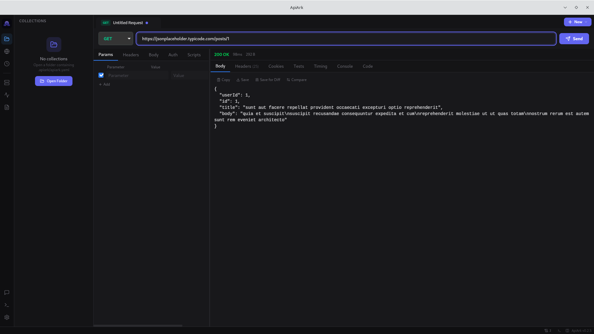
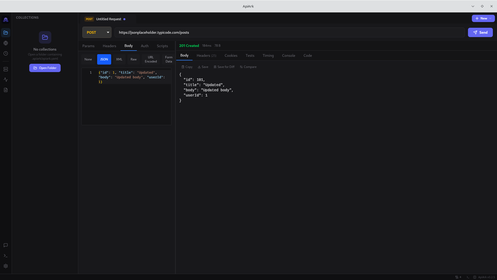
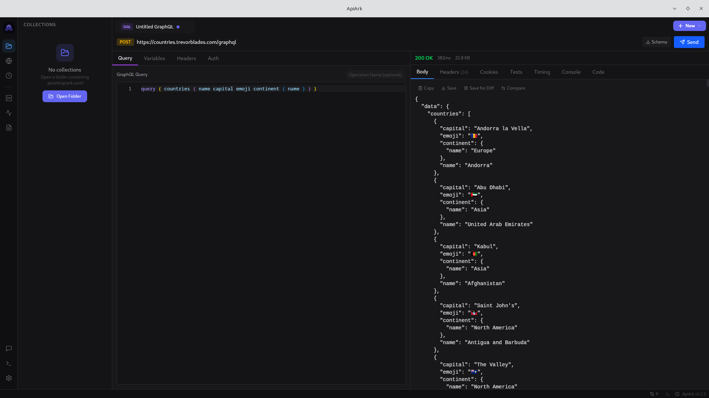
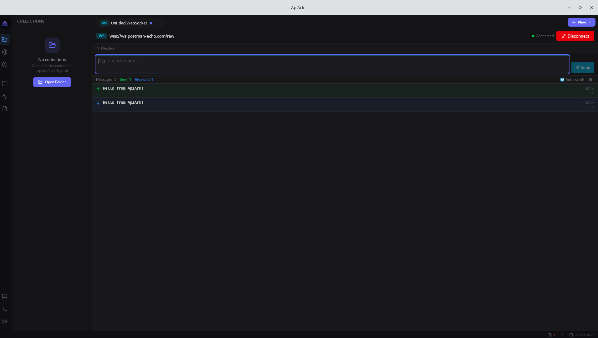
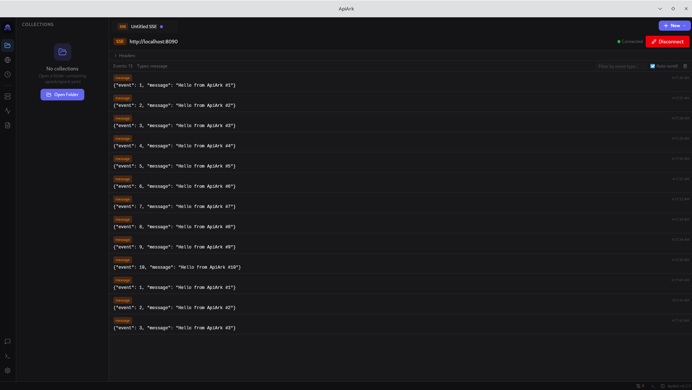
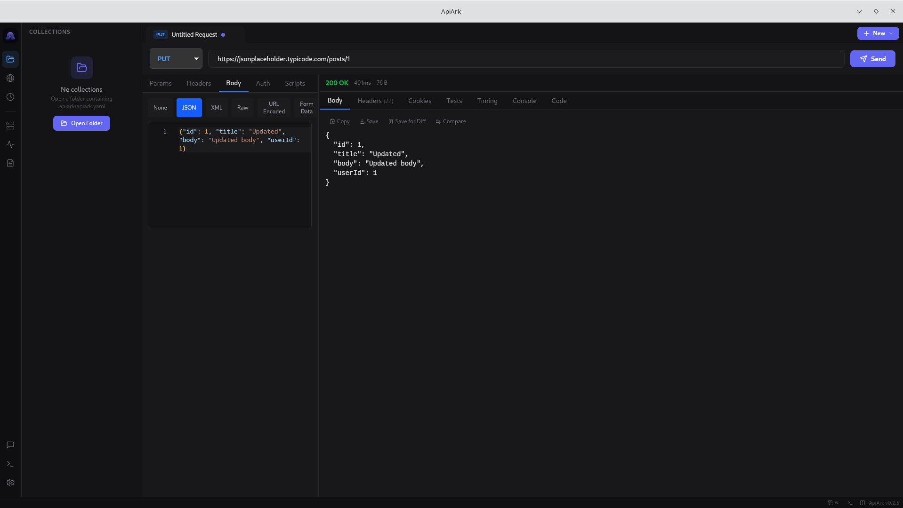
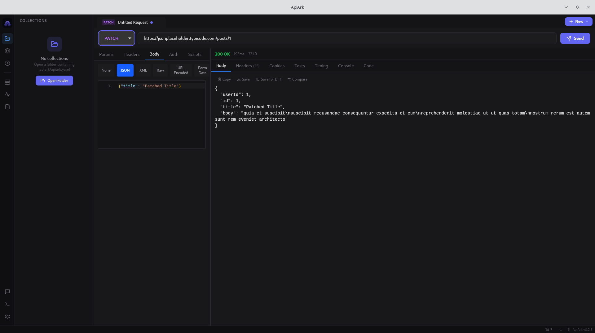
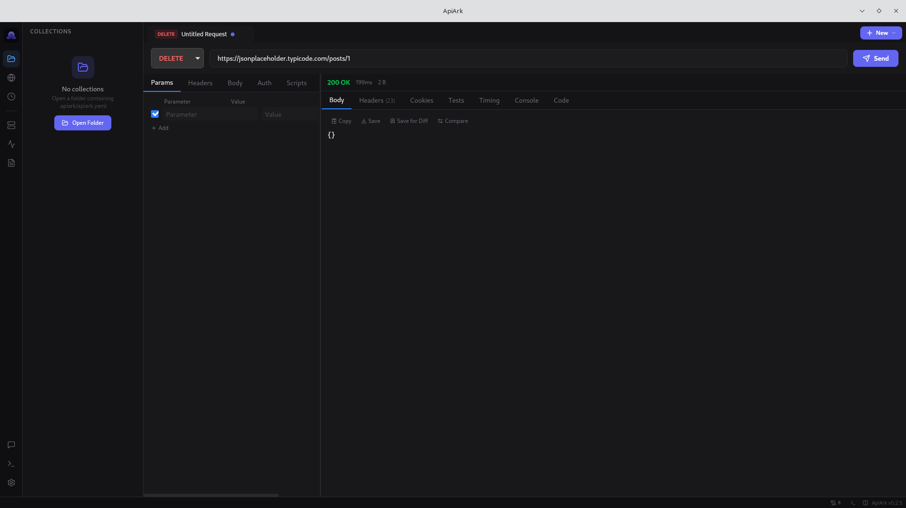

<p align="center">
  
</p>

<h1 align="center">ApiArk</h1>

<h3 align="center">Maintained by ATLAS</h3>

<p align="center">
  <strong>The API platform that respects your privacy, your RAM, and your Git workflow.</strong>
</p>

<p align="center">
  No login. No cloud. No bloat.
</p>

<p align="center">
  <em>Postman uses 800 MB of RAM. ApiArk uses 60 MB.</em>
</p>

<p align="center">
  <a href="https://github.com/ATLASxDevx/apiark/releases/latest"></a>
  <a href="https://github.com/ATLASxDevx/apiark/releases/latest"></a>
  <a href="https://github.com/ATLASxDevx/apiark/stargazers"></a>
  <a href="https://github.com/ATLASxDevx/apiark/actions/workflows/ci.yml"></a>
  <a href="LICENSE"></a>
</p>

<p align="center">
  <a href="https://atlasmedya.net"></a>
  <a href="https://github.com/ATLASxDevx"></a>
</p>

<p align="center">
  <a href="#download">Download</a> &bull;
  <a href="#features">Features</a> &bull;
  <a href="#switching-from-postman">Switching from Postman</a> &bull;
  <a href="#performance">Performance</a> &bull;
  <a href="#t%C3%BCrk%C3%A7e">T&#252;rk&#231;e</a> &bull;
  <a href="#community">Community</a> &bull;
  <a href="#development">Development</a>
</p>

<p align="center">
  <a href="README.md">English</a> &bull;
  <a href="#t%C3%BCrk%C3%A7e">T&#252;rk&#231;e</a> &bull;
  <a href="docs/readme/README_es.md">Espa&#241;ol</a> &bull;
  <a href="docs/readme/README_fr.md">Fran&#231;ais</a> &bull;
  <a href="docs/readme/README_de.md">Deutsch</a> &bull;
  <a href="docs/readme/README_pt.md">Portugu&#234;s</a> &bull;
  <a href="docs/readme/README_zh.md">&#20013;&#25991;</a> &bull;
  <a href="docs/readme/README_ja.md">&#26085;&#26412;&#35486;</a> &bull;
  <a href="docs/readme/README_ko.md">&#54620;&#44397;&#50612;</a> &bull;
  <a href="docs/readme/README_ar.md">&#1575;&#1604;&#1593;&#1585;&#1576;&#1610;&#1577;</a>
</p>

---

> **Built on top of [berbicanes/apiark](https://github.com/berbicanes/apiark).** This fork is maintained by [ATLAS](https://atlasmedya.net) with the following customizations: **Turkish localization, enhanced documentation**.

---

<p align="center">
  
</p>

<details>
<summary><strong>More screenshots</strong></summary>

<table>
<tr>
<td><strong>POST Request</strong></td>
<td><strong>GraphQL</strong></td>
</tr>
<tr>
<td></td>
<td></td>
</tr>
<tr>
<td><strong>WebSocket</strong></td>
<td><strong>Server-Sent Events</strong></td>
</tr>
<tr>
<td></td>
<td></td>
</tr>
<tr>
<td><strong>PUT Request</strong></td>
<td><strong>PATCH Request</strong></td>
</tr>
<tr>
<td></td>
<td></td>
</tr>
<tr>
<td><strong>DELETE Request</strong></td>
<td></td>
</tr>
<tr>
<td></td>
<td></td>
</tr>
</table>

</details>

## Why ApiArk?

| | Postman | Bruno | Hoppscotch | **ApiArk** |
|---|---|---|---|---|
| **Framework** | Electron | Electron | Tauri | **Tauri v2** |
| **RAM Usage** | 300-800 MB | 150-300 MB | 50-80 MB | **~60 MB** |
| **Startup** | 10-30s | 3-8s | <2s | **<2s** |
| **Account Required** | Yes | No | Optional | **No** |
| **Data Storage** | Cloud | Filesystem | IndexedDB | **Filesystem (YAML)** |
| **Git-Friendly** | No | Yes (.bru) | No | **Yes (standard YAML)** |
| **gRPC** | Yes | Yes | No | **Yes** |
| **WebSocket** | Yes | No | Yes | **Yes** |
| **SSE** | Yes | No | Yes | **Yes** |
| **MQTT** | No | No | No | **Yes** |
| **Mock Servers** | Cloud only | No | No | **Local** |
| **Monitors** | Cloud only | No | No | **Local** |
| **Plugin System** | No | No | No | **JS + WASM** |
| **Proxy Capture** | No | No | No | **Yes** |
| **Response Diff** | No | No | No | **Yes** |

## Download

**[Latest Release](https://github.com/ATLASxDevx/apiark/releases/latest)**

| Platform | Download |
|----------|----------|
| **Windows** | [`.exe` installer](https://github.com/ATLASxDevx/apiark/releases/latest) &bull; [`.msi`](https://github.com/ATLASxDevx/apiark/releases/latest) |
| **macOS** | [Apple Silicon `.dmg`](https://github.com/ATLASxDevx/apiark/releases/latest) &bull; [Intel `.dmg`](https://github.com/ATLASxDevx/apiark/releases/latest) |
| **Linux** | [`.AppImage`](https://github.com/ATLASxDevx/apiark/releases/latest) &bull; [`.deb`](https://github.com/ATLASxDevx/apiark/releases/latest) &bull; [`.rpm`](https://github.com/ATLASxDevx/apiark/releases/latest) |

<details>
<summary><strong>Package managers</strong></summary>

```bash
# Homebrew (macOS/Linux) — coming soon
brew install --cask apiark

# Chocolatey (Windows) — coming soon
choco install apiark

# Snap (Linux) — coming soon
sudo snap install apiark

# AUR (Arch Linux) — coming soon
yay -S apiark-bin
```

Interested in maintaining a package? [Open an issue](https://github.com/ATLASxDevx/apiark/issues/new) and we'll work with you.
</details>

<details>
<summary><strong>Build from source</strong></summary>

**Prerequisites:** Node.js 22+, pnpm 10+, Rust toolchain, [Tauri v2 system deps](https://v2.tauri.app/start/prerequisites/)

```bash
git clone https://github.com/ATLASxDevx/apiark.git
cd apiark
pnpm install
pnpm tauri build
```
</details>

## Switching from Postman

1. Export your Postman collection (Collection v2.1 JSON)
2. Open ApiArk
3. `Ctrl+K` > "Import Collection" > select your file
4. Done. Your requests are now YAML files you own.

Also imports from: **Insomnia**, **Bruno**, **Hoppscotch**, **OpenAPI 3.x**, **HAR**, **cURL**.

## Features

**Multi-Protocol** — REST, GraphQL, gRPC, WebSocket, SSE, MQTT, Socket.IO in one app. No tool has broader protocol coverage.

**Local-First Storage** — Every request is a `.yaml` file. Collections are directories. Everything is git-diffable. No proprietary formats.

**Dark Mode + Themes** — Dark, Light, Black/OLED themes with 8 accent colors.

**TypeScript Scripting** — Pre/post-request scripts with full type definitions. `ark.test()`, `ark.expect()`, `ark.env.set()`.

**Collection Runner** — Run entire collections with data-driven testing (CSV/JSON), configurable iterations, JUnit/HTML reports.

**Local Mock Servers** — Create mock APIs from your collections. Faker.js data, latency simulation, error injection. No cloud, no usage limits.

**Scheduled Monitoring** — Cron-based automated testing with desktop notifications and webhook alerts. Runs locally, not on someone else's server.

**API Docs Generation** — Generate HTML + Markdown documentation from your collections.

**OpenAPI Editor** — Edit and lint OpenAPI specs with Spectral integration.

**Response Diff** — Compare responses side-by-side across runs.

**Proxy Capture** — Local intercepting HTTP/HTTPS proxy for traffic inspection and replay.

**AI Assistant** — Natural language to requests, auto-generate tests, OpenAI-compatible API.

**Plugin System** — Extend ApiArk with JavaScript or WASM plugins.

**Import Everything** — Postman, Insomnia, Bruno, Hoppscotch, OpenAPI, HAR, cURL. One-click migration.

## Performance

Built with Tauri v2 (Rust backend + native OS webview), not Electron.

| Metric | Target |
|---|---|
| Binary size | ~20 MB |
| RAM at idle | ~60 MB |
| Cold startup | <2s |
| Request send latency | <10ms overhead |

## Data Format

Your data is plain YAML. No lock-in. No proprietary encoding.

```yaml
# users/create-user.yaml
name: Create User
method: POST
url: "{{baseUrl}}/api/users"

headers:
  Content-Type: application/json

auth:
  type: bearer
  token: "{{adminToken}}"

body:
  type: json
  content: |
    {
      "name": "{{userName}}",
      "email": "{{userEmail}}"
    }

assert:
  status: 201
  body.id: { type: string }
  responseTime: { lt: 2000 }

tests: |
  ark.test("should return created user", () => {
    const body = ark.response.json();
    ark.expect(body).to.have.property("id");
  });
```

## CLI

```bash
# Run a collection
apiark run ./my-collection --env production

# With data-driven testing
apiark run ./my-collection --data users.csv --reporter junit

# Import a Postman collection
apiark import postman-export.json
```

## No Lock-In Pledge

> If you decide to leave ApiArk, your data leaves with you. Every file is a standard format. Every database is open. We will never make it hard to switch away.

---

## T&#252;rk&#231;e

### ApiArk Nedir?

ApiArk, gizliliginize, RAM kullaniminiza ve Git is akisiniza saygi duyan bir API platformudur. Giris yapmaniza, bulut hizmetine veya gereksiz kaynak tuketimine ihtiyac duymaz.

**Postman 800 MB RAM kullanir. ApiArk sadece 60 MB kullanir.**

### Kurulum

#### Hazir Paket ile Kurulum

En son surumu [Releases sayfasindan](https://github.com/ATLASxDevx/apiark/releases/latest) indirebilirsiniz.

| Platform | Indirme |
|----------|---------|
| **Windows** | [`.exe` yukleyici](https://github.com/ATLASxDevx/apiark/releases/latest) &bull; [`.msi`](https://github.com/ATLASxDevx/apiark/releases/latest) |
| **macOS** | [Apple Silicon `.dmg`](https://github.com/ATLASxDevx/apiark/releases/latest) &bull; [Intel `.dmg`](https://github.com/ATLASxDevx/apiark/releases/latest) |
| **Linux** | [`.AppImage`](https://github.com/ATLASxDevx/apiark/releases/latest) &bull; [`.deb`](https://github.com/ATLASxDevx/apiark/releases/latest) &bull; [`.rpm`](https://github.com/ATLASxDevx/apiark/releases/latest) |

#### Kaynaktan Derleme

**Gereksinimler:** Node.js 22+, pnpm 10+, Rust araclari, [Tauri v2 sistem bagimliliklari](https://v2.tauri.app/start/prerequisites/)

```bash
# Depoyu klonlayin
git clone https://github.com/ATLASxDevx/apiark.git

# Proje dizinine girin
cd apiark

# Bagimliliklari yukleyin
pnpm install

# Gelistirme modunda calistirin
pnpm tauri dev

# Uretim icin derleyin
pnpm tauri build
```

#### Postman'dan Gecis

1. Postman koleksiyonunuzu disari aktarin (Collection v2.1 JSON)
2. ApiArk uygulamasini acin
3. `Ctrl+K` > "Import Collection" > dosyanizi secin
4. Tamam. Istekleriniz artik size ait YAML dosyalaridir.

Ayrica su formatlardan da icerik aktarabilirsiniz: **Insomnia**, **Bruno**, **Hoppscotch**, **OpenAPI 3.x**, **HAR**, **cURL**.

#### Komut Satiri Kullanimi (CLI)

```bash
# Bir koleksiyonu calistirin
apiark run ./koleksiyonum --env production

# Veri odakli test ile calistirin
apiark run ./koleksiyonum --data kullanicilar.csv --reporter junit

# Postman koleksiyonunu iceri aktarin
apiark import postman-export.json
```

### Ozellikler

- **Coklu Protokol** — REST, GraphQL, gRPC, WebSocket, SSE, MQTT, Socket.IO tek uygulamada
- **Yerel Depolama** — Her istek bir `.yaml` dosyasidir, Git ile uyumludur
- **Hafif ve Hizli** — ~60 MB RAM, 2 saniyeden kisa acilis suresi
- **TypeScript Betikleri** — On/son istek betikleri, tam tip destegi
- **Koleksiyon Calistiricisi** — Veri odakli testler, JUnit/HTML raporlari
- **Yerel Mock Sunuculari** — Bulut gerektirmez, sinir yoktur
- **Zamanlanmis Izleme** — Cron tabanli otomatik testler, bildirimler
- **Eklenti Sistemi** — JavaScript veya WASM ile genisletilebilir

---

## Community

- [Discord](https://discord.gg/apiark) — COMING SOON
- [Twitter / X](https://x.com/apiabordes) — COMING SOON
- [GitHub Discussions](https://github.com/ATLASxDevx/apiark/discussions) — Ideas, Q&A, show & tell
- [GitHub Issues](https://github.com/ATLASxDevx/apiark/issues) — Bug reports and feature requests
- [ATLAS Website](https://atlasmedya.net) — Maintainer homepage

## Translations

ApiArk UI supports internationalization via `react-i18next`. Currently available in **English**.

Help us translate ApiArk into your language! See the [`locales/`](apps/desktop/src/locales/) directory and submit a PR.

## Development

```bash
# Install dependencies
pnpm install

# Run in development mode
pnpm tauri dev

# TypeScript check
pnpm -C apps/desktop exec tsc --noEmit

# Build for production
pnpm tauri build
```

### Project Structure

```
apiark/
├── apps/
│   ├── desktop/           # Tauri v2 desktop app
│   │   ├── src/           # React frontend
│   │   └── src-tauri/     # Rust backend
│   ├── cli/               # CLI tool (Rust)
│   ├── mcp-server/        # MCP server for AI editors
│   └── vscode-extension/  # VS Code extension
├── packages/
│   ├── types/             # Shared TypeScript types
│   └── importer/          # Collection importers
└── CLAUDE.md              # Full product & engineering blueprint
```

### Tech Stack

**Frontend:** React 19, TypeScript, Vite 6, Zustand, Tailwind CSS 4, Monaco Editor, Radix UI

**Backend:** Rust, Tauri v2, reqwest, tokio, tonic (gRPC), axum (mock servers), deno_core (scripting)

## Contributing

Contributions are welcome! Please read the [CLAUDE.md](CLAUDE.md) blueprint for architecture details and conventions.

<a href="https://github.com/ATLASxDevx/apiark/graphs/contributors">
  
</a>

## Credits

Built on top of [berbicanes/apiark](https://github.com/berbicanes/apiark). Original project by [berbicanes](https://github.com/berbicanes).

This fork is maintained by **[ATLAS](https://atlasmedya.net)** ([ATLASxDevx](https://github.com/ATLASxDevx)) with the following customizations:

- **Turkish localization** — Full Turkish installation guide and feature documentation
- **Enhanced documentation** — Improved README with bilingual content and additional guidance

## License

[MIT](LICENSE)

---

<p align="center">
  <sub>If ApiArk helps your workflow, consider giving it a star. It helps others discover the project.</sub>
</p>

<p align="center">
  <sub>Maintained with care by <a href="https://atlasmedya.net">ATLAS</a></sub>
</p>
